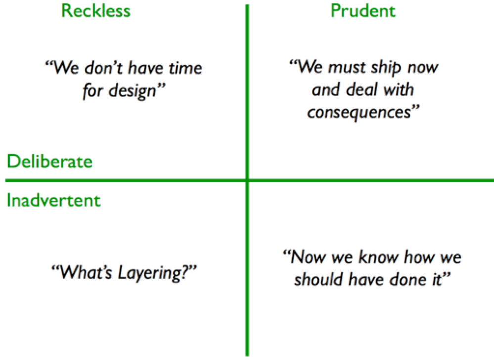
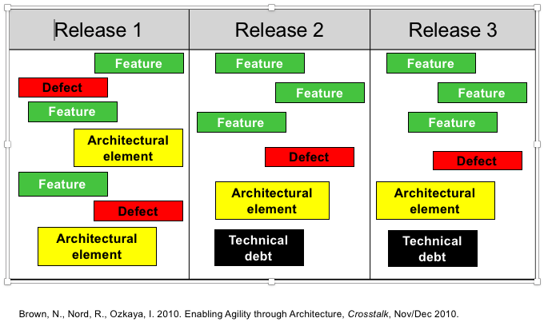
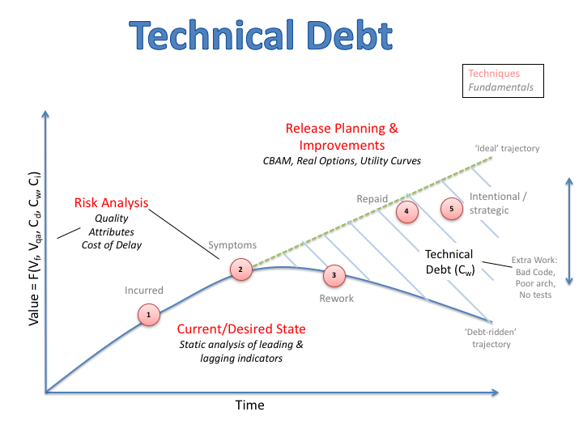
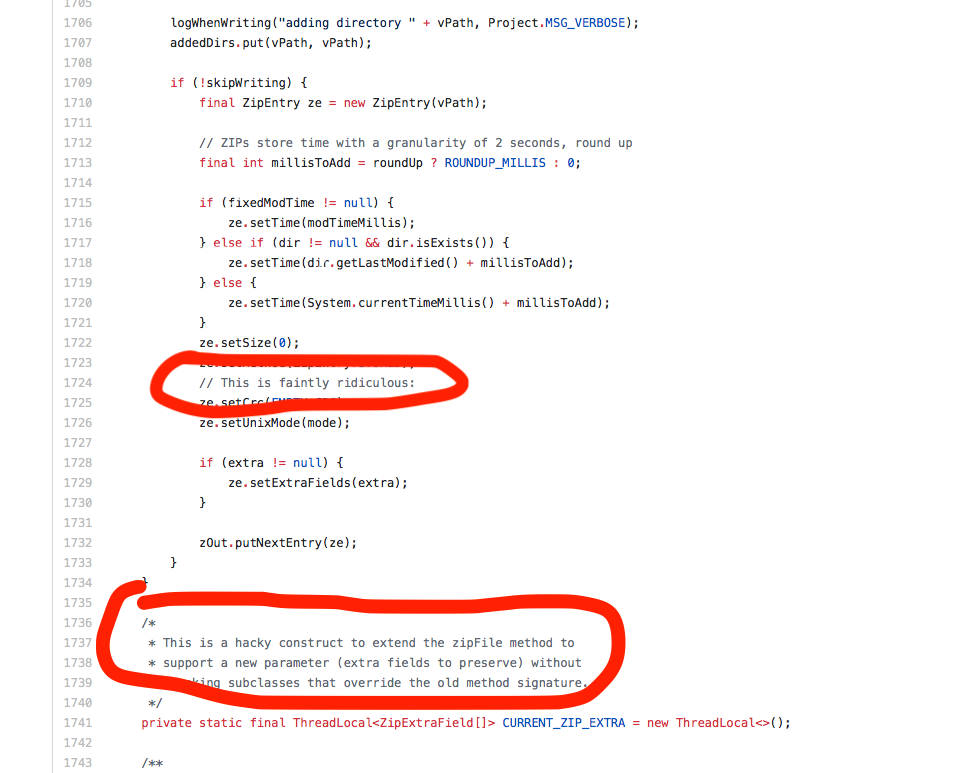

# What is Technical Debt

Survey of the class

The term was initially used to refer to the gap between what we initially think the system ought to be (release 1), and what we subsequently learn should be different. Technical debt in this definition is then inevitable and desirable, because it delivers "working code"---*so long as we refactor our code to remove it*. Unfortunately, in many cases this refactoring is never done. 

> "Shipping first time code is like going into debt. A little debt speeds development so long as it is paid back promptly with a rewrite... The danger occurs when the debt is not repaid. Every minute spent on not-quite-right code counts as interest on that debt. Entire engineering organizations can be brought to a stand-still under the debt load of an unconsolidated implementation, object-oriented or otherwise." Ward Cunningham, 1992

Most recently technical debt is a term of art that captures an elegant, business-friendly way to communicate the importance of refactoring and maintaining software. Recall that unlike hardware, software is extremely easy to change, and therefore arguably constitutes a dramatic paradigm shift for management. As an example, many businesses buy complex machinery to make their widgets. There is a well-understood and generally accepted approach to *depreciating* these assets, that is, writing them off over time as their useful life approaches an end. Software is not often thought of as a depreciable asset, but it **should be**! Like anything, unmaintained software loses value over time.
 
The definition I'll use is the following:

> Technical debt occurs when a design or construction approach is taken that's expedient in the short term, but that creates a technical context that increases complexity and cost in the long term.

Some examples include:

- Code has become very hard to change because of the foundation of poor quality legacy code
- The system cannot be tuned for optimal behavior because cross-cutting concerns such as maintainability has not been addressed strategically
- Knowledge of quality is lacking because testing has been cut short in the interest of time

Again, in modern software process, incurring debt can be a good thing, if it means you ship software and meet deadlines. For example, what is the value of a Valentine's promotion that is released Feb 15?

Martin Fowler has a quadrant that outlines this:

We don't mind being at the top right (that's the sweet spot on any quad chart, by the way!). The problem is transitioning out of the other quadrants. This asks for a level of self-discipline and introspection that is hard to do: acquire funding from management for a maintenance sprint, put off feature delivery for a few weeks, remember where exactly the shortcuts were. Plus, in large government contracts, your company may not even have the contract to "operate and maintain" the software. Now the debt is someone else's problem.

## Managing Technical Debt

Philippe Kruchten has a nice conceptualization of what role technical debt plays in software development.

Here TD is seen as an invisible, negative value for your code. Again, in the extremely short term TD is not bad. It become bad as time passes and the debt accrues. 

We call the impact of accrued debt *interest*, which refers to the ongoing added costs you have to pay. This can be in terms of longer release times, longer test runs, cognitive burden on developers, or other measures of impedance caused by imperfect code.

Managing technical debt comes down to two things. 

1. Visibility. It is essential to track the TD you incur at the time you incur it. Otherwise, it festers in silence. Like any bug, sunlight will kill it.
2. Allocating money. Once you know it exists, you need to pay it off. Include TD in rational iteration planning process. As you can see in [the DHH video I posted](https://www.youtube.com/watch?v=H5i1gdwe1Ls&t=1s) earlier, the Basecamp team explicitly allow developers to go refactor problematic code. This can be as simple as changing a variable name, or as complex as adding or removing files and classes (if the 'refactoring' turns into something more complex, it is really about re-architecting, and deserves different treatment, unless your codebase and devops infrastructures are *really* solid).

The following chart shows how we might see TD as a 'drift' between some ideal state (high value) and the actual state.

# Code Quality Tools
How do you find technical debt? In many cases the debt has been incurred a long time ago, and all you know now is that things suck (high interest costs). 

Self-admitted technical debt (SATD) is a term coined by Emad Shihab to capture comments in the code that 'admit' that a particular approach is a hack, or poor form. In some cases it might be captured in a tool, but it is unlikely. They aren't bugs; the code works. Just not as ideal as one might hope. Grepping for these comments can be a good way to find TD. Just ensure it is architecturally interesting. The obvious downside is some code style guides explicitly frown on these types of comments.

There is a continuum of "bad practices" that in my view extends from the code level up to the design level. Tools can capture many of these. But as we move 'down' the taxonomy, the clarity of the violation is reduced (harder to justify), and the ability for a tool to detect it becomes harder. Think about how one might catch a buffer overflow error, vs designing code that doesn't even use array indices.

There are many tools now that will help catch problems at the first few levels of this hierarchy, but the holy grail remains those violations at the design level. [In a study my colleagues and I](https://insights.sei.cmu.edu/sei_blog/2015/07/a-field-study-of-technical-debt.html) ran, we were told that architectural choices are the largest source of debt. Accordingly, it stands to reason finding these issues is the most important 'rule' to validate. However, to the best of my knowledge this is still a pretty unsolved problem. [Tushar Sharma](http://www.tusharma.in/smells/ARCH.html) has done most of the work on trying to automate these issues. 

Some examples of tools include linters like Pylint, code smell analysis tools like Findbugs, and the platform analysis tools (which incorporate all sorts of analyses) like SonarQube and Codescene. 

At the end of the day, as a tool user, you should keep the following in mind:

 
# New Research Directions
The last five years have seen an explosion in the amount of data we have on software engineering practices. Tools have also gotten better, and applying machine learning, including deep networks, to software is a hot area. More and more companies are tracking data on how code is written, including who wrote what, how much churn there is, and more. There is also a lot of work on making tools smarter and aiding developers. 

For example, the [Tricorder project](https://research.google.com/pubs/pub43322.html) at Google (now open sourced as [Shipshape](https://github.com/google/shipshape)) is a static analysis platform for checking a large variety of rules, including Android linting and security analysis, custom team-specific rules, and more. The interesting development is the focus on *not pestering the dev unnecessarily*, a major problem in the past. [A good paper](https://cacm.acm.org/magazines/2010/2/69354-a-few-billion-lines-of-code-later/fulltext) on this is from the folks working on the Coverity security scanner. In that paper they report on the key lessons for how to be effective in alerting users. 

Similarly, at UBER, they use the [NEAL tool](https://github.com/uber/NEAL) to do linting for their code. Companies have realized that preventing these problems is incredibly important, and that code review is too expensive to waste on machine-findable problems.
