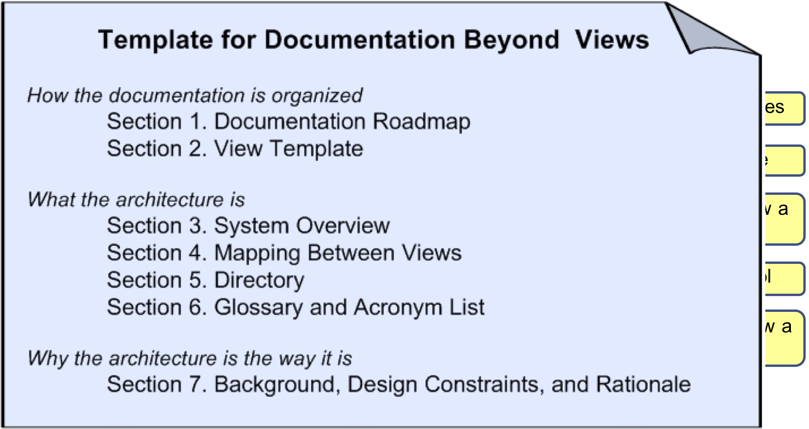

# Human-centric docs
## Choosing views
In this class we have focused on 2 views for our project: C&C and Module views (1 of each). Recall that the final type of view is Allocation views, which reflect the non-software structures. An obvious question (that arose for some of you in M3) is "how many and what kind of views should be shown?"

As we have been discussing, the most obvious way to do this is to relate it back to the business goals for your system, along with the stakeholders. Again, we aren't documenting anything just because. We document something because someone cares to know the answer. Ultimately, the views you include in the docs are the ones most important to answer stakeholder questions.

This will usually involve a couple of module views and runtime C&C views. Let's look at a more detailed example from the book to see how we might do this more systematically.

## Stakeholder table
A stakeholder table uses rows for the stakeholders of our system, and columns for the styles we might capture about our system. We enter either D(etailed), S(ome), or O(verview) to show the degree of interest each stakeholder group has in a particular view. Then, we can combine the views to prioritize the information our stakeholders need. 

Let's take a look at a view table for Keras. 

The stakeholders are: 

The key views are:

These views apply to all systems:

**Module views**
* Decomposition
* Uses
* Data Model
**Allocation views**
* Deployment
* Install
* Work Assignment

These views apply to some systems:

**Module views**
* Generalization
* Layered
* Aspects
**C&C views**
* Pipe-and-Filter
* Shared-Data
* SOA
* Client-Server
* Peer-to-Peer
* Communicating-Processes

Once we have our view table, and our combined views, we can *stage* the docs in order to address the most pressing needs first. For example, if we are building a new system and need to let a contract, we might construct the work assignment view and module views showing the high level structures of the system. Detailed views for communicating processes could be left until those parts of the system are being built. 

# Representation formats
In this course we have gone for my favorite (currently!) approach to documentation, a hybrid of hypertext and plain text using Markdown. The benefit is that it is pretty easy, once you have some primitive structure, to convert to other formats and more sophisticated presentation. The downside is that few people seem to understand what plain text is. 

One approach is to make your docs auto-generated from code, an "architecturally-evident coding style" as George Fairbanks calls it. This means you add detail in Javadoc or doc strings to hint at the architectural role. 

Another approach is to follow [Simon Brown's "C4" diagrams](https://c4model.com) and method: begin with Context, Containers, and Components, end with Code.

<!-- 
Enterprise Architect
JetUML
 -->

# Packaging documentation

We've talked a lot about specific views. But we've only had time to do 2, and as we just saw, a few more are likely needed. Plus, as we discussed earlier, there's a bunch of other information that doesn't seem to fit anywhere. How can we sort this out? What else should be in there?

Here's a template for "beyond views" documentation, the stuff we don't get in any one view.  Use this structure to guide your M6 work.

1. Roadmap: a table of contents, at the least, but most useful when it explains where to find everything.
2. Template: just the one we used for each view. Boilerplate.
3. Overview: can be a 'marketicture' for your system, capturing the raison d'être for the 50,000 foot view.
4. Mapping: critical; helps to map one element to another. E.g., client in the module view is instantiated as "jclient" in C&C and part of "ui.jar" in the deployment.
5. Directory: index
6. Glossary: the key terms, particularly contentious or domain-specific terms.
7. Rationale: detail the cross-view design decisions and overall approach

# Reviewing documentation
Let's say we have created this wonderful piece of documentation, lovely diagrams, nice use of colour, and we have a detailed knowledge about the system. How do we know if our documents are any good? 

Recall that one of the key principles of our documentation is to review our documents to assess suitability. Does it contain the right information? Help the stakeholders? Answer the important questions?

We need to review what we created to ensure it can do all of this. We aren't reviewing the system architecture itself; we are reviewing the document we need to get to that point. We want to avoid wasting time in a meeting when we realize the document can't help answer a particular question.

## Review steps
1. Establish what the review is doing. Identify the key stakeholders; then decide what the document should be able to do: architecture evaluation exercises? onboarding newcomers? preparing a contract? standards compliance?
2. Find the relevant documents. This is easy in our case, since there is just the one, but in many systems, there are dozens of relevant documents (interface standards, runtime analysis, glossaries, and so on). 
3. Figure out a good set of questions. What types of questions should the document answer. Use the answer in Step 1. The question set should explain who should be able to respond to the question, as well as expected answers.
4. Plan the details of the review.
5. Perform the review.
6. Analyze and summarize the results. The end result is a decision as to whether or not the document will help fulfil the purpose.

## Example questions
You can find more questions in the reading I linked to.

### Supporting Evaluation
Help understand whether or not this document helps us evaluate the architecture.

1. Are the business goals clear? 
2. Can we trace from business goals to architectural elements?
3. Are the ASRs clear and testable?
4. Is it clear which view supports which ASR?
5. Is the context clear?
6. Is there enough preliminary information to assess QAS conformance?
