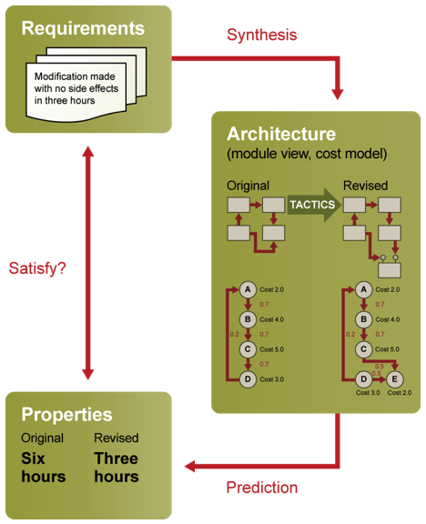
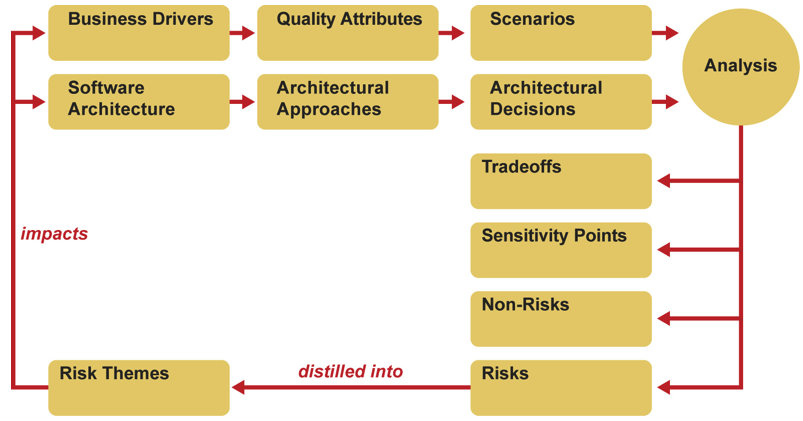

# Why

**Software design** is about creating a context (the architecture) for developers to write code that satisfies our objectives for the system. These objectives, in our framework, are the business goals we have for this system (generate revenue, increase users, support data analytics, save citizens time). We realize these objectives by understanding our prioritized quality attribute scenarios and architecture drivers for the system (what does performance mean? do we have to support mobile? can we assume this will be in Java?). 

**Software analysis** is about assessing our design (or other people's) with respect to these goals. Did the design choices support the business goals? Given our experience and knowledge, can we have some certainty that this design will "work"?

An important note: we are not trying to get to 100% certainty. A) it probably isn't possible and B) that would take more money than would make sense (most of the time). Consider the Boehm curve about up-front analysis vs rework.

There's a good tweet series from Simon Brown about how much upfront analysis and thinking is needed. And the quote:
> A week of programming can save an hour of thinking.

And keep in mind that optimizing for one goal often implies suboptimal solutions for the other goals. If you think a change is nothing but beneficial, you might be missing something.

# Techniques
Architecture analysis can be internal; you whiteboard a possible design with some knowledgeable team-mates and assess flaws. This assumes you are disciplined enough to be truly reflective, that people feel comfortable criticizing each other, and that you can see past your own biases.

It can also be external, either with architecture review boards, like I mentioned last class, or external analysis teams from consultants. 

In nearly every case you will want to have a clear set of criteria by which the design can be said to help or hurt. In our framework these are the quality attribute scenarios which can act as "tests" for our rough analysis.

# ATAM
The Architecture Tradeoff Analysis Method (ATAM) is what the textbook presents as one, fairly heavyweight form of architecture analysis. 

The end goal of an ATAM is a list of possible risks that the system design, as currently stated, is facing. 

Once you have identified risks, your next task, obviously, is to prioritize the risks and fix the architecture with redesign/refactoring.

## Steps in an ATAM
1.  *Present the ATAM*. The consultants explain what is going to happen.
2.  *Present business drivers*. The business team/owner show what business priorities exist for the system. This includes important quality attribute requirements and drivers.
3.  *Present architecture*. The technical team/architect explains the current state of the system. This might be the existing codebase, or some proposed design approaches. Most often the ATAM works best when the design is hypothetical (avoid rework!). This presentation should delineate the key architectural approaches. At this point the analysis team will begin probing for risks. 
4.  *Identify architectural approaches*. Following the technical details, specific architectural structures can be identified. For example, choice to use a given framework such as Meteor; converting a monolith to microservices; upgrading JVM to v 1.8.
5.  *Generate quality attribute utility tree.* From the business priorities, we can now formulate the prioritized scenarios. 
6.  *Analyze architectural approaches*. Since we have prioritized the scenarios, we start our analysis of the approaches using the most important (HH) scenarios. 
7.  *Brainstorm and prioritize scenarios*. These are phase 2 activities: we bring in a wider group of stakeholders and broaden our prioritization and scenario generation.
8.  *Analyze architectural approache*s. Repeat step 6 with the new QAS.
9.  *Present results*. The analysis team gets together and synthesizes the risks into a manageable list for the clients to digest.

## Outputs

- **Risks** – potentially problematic architectural decisions. Example: business logic is tied up in the SQL triggers, which makes it hard to extract when modernizing.
- **Non-risks** – good architectural decisions that are frequently implicit in the architecture. Example: using Travis-CI for integration testing will help visibility and tool support for testing.
- **Sensitivity points** – a property of one or more components (and/or component relationships) that is critical for achieving a particular quality attribute response. Example: choosing Meteor as a framework makes it possible that Meteor breaking changes will hurt performance.
- **Tradeoffs** – a property that affects more than one attribute and is a sensitivity point for more than one attribute. Example: using 1024 bit encryption will help security but affect performance.

# ARID
Active Reviews for Intermediate Designs

* "timely discovery of errors, inconsistencies, or inadequacies"
* avoid stacks of documents approach 
* drive design reviews using scenarios **testing** the key goals
* don't assume all relevant stakeholders are available

## ARID structure
* 3 teams: 
	* review team (scribe, facilitator, observers)
	* lead designer
	* reviewers (stakeholders for design, e.g. devs who will use it)
* Process:
	* Outline ARID process 
	* Present design
	* Identify scenarios
	* Review design

A lightweight ATAM that does not insist on *all* stakeholders being present. Downside is you are more likely to miss key scenarios and architecture drivers.

---
# Exercise

Take your M3/M4 documents as evidence of the system's architecture. For one of your QAS, generate 1 possible *risk* that this system is facing, and identify 1 sensitivity point.

# References
- [Google/Hillary design reviews](https://medium.com/git-out-the-vote/strengthening-products-and-teams-with-technical-design-reviews-ae6a1bec5216)
- [Design Doc template](https://docs.google.com/document/d/1uMHzRsEDZb_p9xfFGerCVhr-0mAi-d-OFY4jJi0dYk4/edit)
- [Test automation review](https://msdn.microsoft.com/en-us/library/ff521647.aspx)
- [Evolutionary Architecture](https://www.oreilly.com/ideas/neal-ford-on-evolutionary-architecture)
- [Code sizes](https://informationisbeautiful.net/visualizations/million-lines-of-code/)