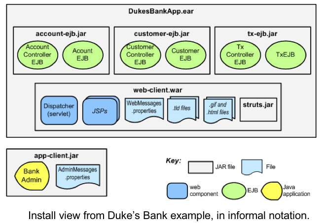
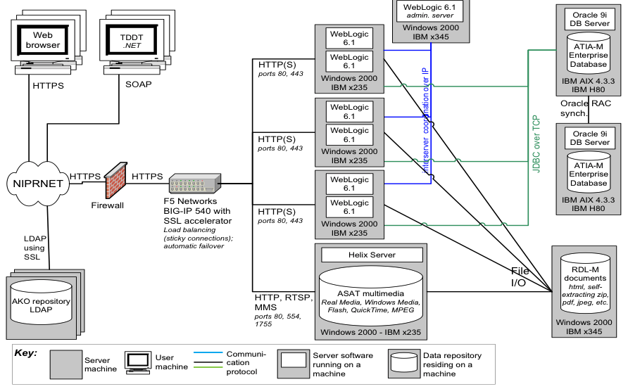
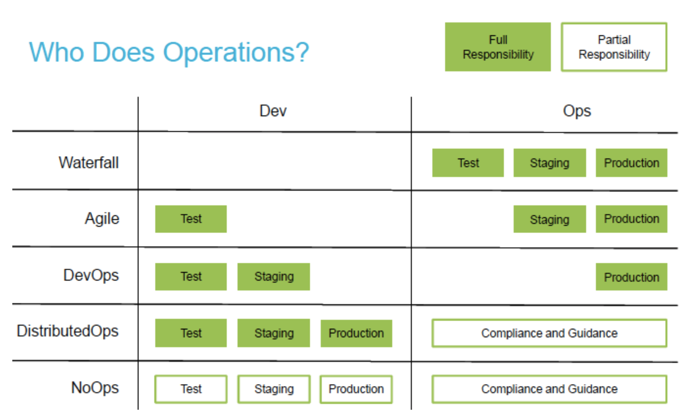

So far we have talked about 2 main categories of views. The third category is known as allocation views, since we *allocate* (map) the software parts of our system to the non-software aspects. 

There are as usual many instance of allocation views. We can focus on the following:

1. Install styles
2. Deployment styles
3. Work assignment styles

Of these the work assignment style is most straightforward: our view will capture who is responsible for which piece of our system. 

The *Install* style and the *deployment* style are specifically **operations** related. Install styles refer to the software elements needed to make the system work, e.g., Jar files, server config files, Puppet scripts, and so on. The deployment style focuses on what hardware the software will be allocated to: virtual machines, firewalls, routers, cloud instances, etc.

This historically was not seen as "proper" software architecture, but fortunately this perspective is now seen as outdated. Deployment and operations are critical to think about and in many cases are significant architecture drivers. You can expect that most high-performance companies will care very deeply about how the software gets deployed, where it runs, and how much all that costs. 

DevOps is a term you may have heard. This is a portmanteau for "Development and Operations" and quite simply is intended to capture the idea that these two ideas are inextricably linked (and should never be seen as silos). 

From an architectural point of view we need to understand how our DevOps concerns will impact the design of the software, including installation and deployment approaches. For example, if we have a highly coupled system, testing and releasing incrementally will be much more difficult. This is a big reason behind the push to microservices---decoupling the modules to support rapid deployment. At the same time, of course, complete decoupling can lead to duplication of functionality and code cloning, so once again we see a tradeoff. 

# Installation Style

*Elements:* runtime software components, including runtime requirements in production (e.g. file permissions). Environmental elements of configuration such as files and folders. 
*Relations*: *allocated-to*, *contained-in*
*Usage*: create build process, navigate the file system, product line configuration, automatic updates

## Example of an Install Style

# Deployment Style

*Elements:* runtime software components, including properties required such as memory, disk space, network capacity, fault tolerance. Environmental elements like network layout, hardware capacity, and other constraints affecting deployment.
*Relations*: *allocated-to*, *migrates to*. Include rationale about how things can change dynamically.
*Usage*: analyze performance, security, relationships with network operations, security enclaves, communication volumes, reliability.

## Example of a Deployment Style

# Emerging Topics in Documenting Operations

In the web era operations has become a massive concern. Millions of dollars are at stake if deployments fail or operations go down. And of course the entire business model of AWS is to support operations for you. This wasn't always the case: operations might have been "and now we create an exe and stick it in the /Applications folder". 

There are some new concerns that have emerged over the past 10 years that cry out for new styles, that may be different than strict installation and deployment styles.

For one thing, we might want to document *how* the release process works. This is possibly a behavioral view on a deployment view, but I am thinking of something more fundamental: a style to capture the deployment-time process that needs to happen. 

E.g., [this Facebook deployment model](https://code.facebook.com/posts/270314900139291/rapid-release-at-massive-scale/) is a context diagram for how an engineer can release code at Facebook. One of the big changes in DevOps is the notion that every developer is responsible for their own code. Implicit in this shift is that each developer must either know, or be supported by tools that can navigate the release model.

A colleague, Chris Parnin, has the [following nice graphic](https://github.com/CSC-DevOps/Course) explaining the shift in developer responsibilities. 

Another example is where feature toggles get set in the code. This article makes for a good overview of the issues. 

You also want to enable developers to understand, and thus have documented, various release mechanisms like we see in the following picture. Somewhere, there should be a document explaining all this!

Like every view style in this course, we should always remember that documenting and understanding software is a creative process and in many ways *hard or impossible to automate* in its entirety.

# Exercise
Look at your project system. Sketch out a quick install style that shows how the software structures look in operation. Your style should include reference to deployment steps necessary. For example, if I want to characterize the install style for the University's financial accounting software, I would need to refer to operating systems required to run it, what application server software (and version, and dependencies) are necessary, what database backend it can handle, how it interacts with the universal log in service (e.g. directory service).

A network topology is a natural starting point. Remember this is from the perspective of the developers, not the users.

# References
- Rozanski and Woods, Software Systems Architecture, Chapter 21 (The Operational Viewpoint)
- Len Bass, Ingo Weber, Liming Zhu, DevOps: A Software Architect's Perspective
- Continuous Delivery, Jez Humble and David Farley
- the Phoenix Project, Gene Kim