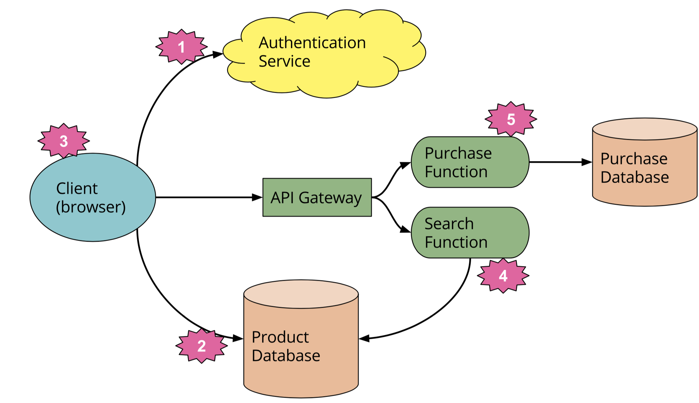

I wanted to spend our last lecture talking about some new and emerging concepts in how we build and understand software.

Let me recap by summarizing what I think are the takeways from this course.

1. Reading code happens more than writing code. 
	- > “Indeed, the ratio of time spent reading versus writing is well over 10 to 1. We are constantly reading old code as part of the effort to write new code. ...[Therefore,] making it easy to read makes it easier to write.” - Martin, Clean Code
	
	- Singer et al. recorded developers spending < 25% of their time making source edits.
2. Reading code is made easier by appropriate documentation. A guest speaker once gave an interesting example of a high-impact system based on sFTP and XML documents where the original developer spent a lot of effort capturing the business logic in ASCII comments and diagrams, much to his team's amusement. However, that effort saved thousands of dollars when it was time to port the system to a new sFTP service.
3. "Appropriate" is hard to define, but we suggested it wasn't too hard to figure out. Do some rough "Fermi" approximations of how complex/long-lived/difficult to fix something is, and spend that much effort documenting it. Balance the return with the cost. 
4. Remember our 7 principles of effective documentation:
	1. Write for the reader
	2. Avoid repetition
	3. Avoid ambiguity
	4. Organize and standardize
	5. Record rationale
	6. Keep it current 
	7. Review the documentation
5. Architecture is defined as "the set of structures needed to reason about the system, which comprise the software elements, relations among them, and properties of both. (text p.4)"
6. Our reasoning about the system is generated from our (technical perspective) understanding of system business goals, prioritized architecture drivers and quality attribute scenarios. 
7. We can reason about our system, given suitable documentation, using the scenarios to test how well the design meets our business goals. 

**Exercise**: let's say we are all working on a system to improve room scheduling for Uvic. What key business goals would we have? What might be some quality attribute scenarios and other architecture drivers?

# Emerging Topics

I've taken this section from following Twitter and topics we have published at the most recent academic [conference on software architecture](http://icsa-conferences.org/2018), ICSA.

## Microservices
Can someone give me their definition of microservices? 

Lewis and Fowler have a nice [introduction to this concept](https://martinfowler.com/articles/microservices.html). The following images come from that article. 

The basic idea is that organizational structure is recapitulated in the software structures. This means there are unwanted dependencies, particularly at release time, between our software. Instead, we could organize around cross-functional business 'service' teams, respecting the [2-pizza rule](http://blog.jasoncrawford.org/two-pizza-teams). 

If you have these business service teams, you get to focus on each team owning its own service (micro), and not have big integration worries. 

We need to be careful. Making an organization into one organized around microservices is a pretty radical change, particularly for large companies or government entities. There's a danger that we try to move to microservices and end up stuck between what we had before - the monolithic entity that released in step - and microservices. Simon Brown has called this the "distributed big ball of mud". Now we get the worst of both worlds: duplication and organizational complexity, with all the tight coupling of the monolith. 

Research is looking at how one can identify potential microservices; how to migrate to microservice architectures; how to draw component boundaries; and how to manage and organize microservices. 

## Lambda/Serverless
Related to the microservice paradigm is that of "serverless computing". Can someone define this for us? 

Broadly, this is a Cloud operations shift. Some of you may be familiar with the terms PAAS, IAAS, SAAS?

The Cloud is broadly the following ideas ("other people's servers"):

* IAAS - Infrastructure as Service. The provider makes the OS and hardware and network capability available, but you are responsible for installing libraries and software. Amazon AMIs are examples of IAAS. 
* PAAS - Platform as Service. The OS, common libraries, server software, etc are provided for you. Heroku is an example of PAAS.
* SAAS - Software as a Service. An arm's length entity is responsible for the entire stack of an application. Your users sign in and run tools on their servers. Salesforce, Facebook are examples of SAAS.

[Serverless computing](https://martinfowler.com/articles/serverless.html) takes the idea of PAAS and breaks it down. One acronym is "FAAS" or Function as Service. Where PAAS might still require us to essentially write all the logic for our application, in FAAS/Serverless (best characterized by AWS Lambda or Google Cloud Functions) we take common 'functions' of our application and let Amazon or other cloud providers take responsibility for providing it (at scale). FAAS means:

- Stateless
- Event-driven
- Ephemeral 
- Managed by 3rd party (eg. Amazon)
- More logic in client (e.g. storing state)
- Limited lifetime

Challenges:

- vendor lockin
- multitenancy
- managing state
- testing

Another approach mentioned in the Fowler article is the idea of "backend as service". Here, common functionality not core to the application -- think login and authentication -- is offloaded to a 3rd party. 

Architecturally, this means that even the complex apps you have been looking at in this course are made more difficult to understand. We must understand the SLAs of the specific cloud platform (e.g. cold start times) in addition to our own internal architecture. We gain auto-scaling and management but reasoning about the QAS might be considerably harder. 

Serverless example

## Machine learning and architecture

An area I'm doing active research in is the integration of probabilistic programs into conventional software architectures. A probabilistic program, at its most basic, is the idea that instead of taking on a set value (i=2), the variables are random variables with value derived from a probability distribution (e.g. the Normal). We have a good understanding of how to build and architect systems that are conventional imperative, OO programs (e.g. Java EE, Spring, Rails). But increasingly our software will be encoding complex decision procedures that are difficult to express in these languages. For example, we could build a rule-based system for firing actions in response to monitoring. This was what expert systems were in the 80s and 90s. But they didn't scale well and missed a lot of complexity. 

Nowadays, we make decisions probabilistically: the Uber crash recently is based on a decision procedure that has to weigh evidence from sensors to take some action (apply brakes, steer right, etc). The evidence is all probabilistic: this is a pedestrian heading right with probability 80%. It is far from clear the best way to structure programs to accommodate these new types of data (or how to test them). 

Furthermore, the machine learning programs behind these decisions are often incredibly complex. A [paper from Google](https://research.google.com/pubs/pub43146.html) calls this the "high interest credit card of technical debt".  Managing a suite of Tensorflow models, for example, quickly becomes challenging. For one thing, we need to document the hyper-parameters we are using. In a case like the Uber crash, regulators will want to know how the algorithm was trained. 

Mandatory XKCD cartoon:

## Other topics!

This is a very exciting time to work on software. 

* Blockchain
* IoT / Edge computing / Cyberphysical systems
* Event-driven systems
* Evolutionary architectures

## Panel
Five students with previous experience will discuss their work with software architecture. 