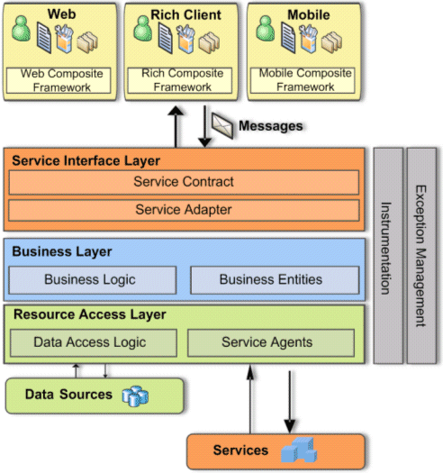

# Recall Our Definition
Here is the definition we will use. It is designed to orient us to the notion that there is not just one **thing** to call the architecture, but rather a set of *structures* that help us reason about what the system is doing.

> The software architecture of a system is the set of structures needed to reason about the system, which comprise the software elements, relations among them, and properties of both. (text p.4)
> 

# Other "architectures"

* *Enterprise Architecture* - business structures and the processes that connect them. see the Zachmann framework, DODAF, among others. Oversee the organization's entire portfolio of IT assets including staff, hardware (switches, PCs, servers, cloud), software (payroll systems, OS, custom software, databases).
* *System Architecture* - as with all of these terms, overused, but in my view, this describes the people who do system engineering activities. Oversight of end-to-end production, including hardware components, managing subcontractors, ensuring the connections make sense between subsystems, preparing documents for design reviews with major stakeholders, understanding budgeting and legal "in the large"
* *Hardware Architecture* - chip and circuit design, network design, FPGAs, etc.

# Why "Document"
There are three major modes for creating a software model. Recall that models - blueprints, computer code, boxes and lines, tables of contents - are supposed to be useful abstractions when the real world is too complex to reason with. [Per Martin Fowler](https://martinfowler.com/bliki/UmlMode.html), we have three main modes for diagrams:

- Diagram as Sketch
- Diagram as Blueprint
- Diagram as Executable

The point is that a diagram that works in one context, will not usually work in the others. A nice piece of research by Microsoft Researchers showed that a whiteboard functioned as an 'information radiator'; the sketches done in the moment were a reference for the developers. But only while the project was in full flush. If you look at a diagram like this:

 
you can see why. I hope. 

## Problems
- what are we learning? There are lots of boxes? Messages are being passed around? 
- The applications involved and the elements they comprise?
- The system has multiple tiers?
- The data, control, and communication mechanisms that are used?

What is missing:
- when and where do things exist? 
- what is going on at runtime?
- how do we deploy this? 
- what does each element do wrt requirements? responsibilities?
- what are the connections?
- what do the colors mean?

The other modes, blueprint and executable, are really about making models do more than communicate in the short term. In the Blueprint approach, we want to *hand off* our models to downstream users, like architects do in the real world for buildings. 

In the Model as Executable, we are actually writing the program by building the model. This is most common where there are tight constraints on safety or security, such as in automotive. In this mode, we use a tool like Simulink to draw block diagrams that a verified compiler can translate into safe (ish) C code. 

## Anecdote: becoming an architect

>I’m not exactly sure when I became a software architect. I do remember the first time someone else called me one. We were at an important client meeting. The client asked a really tough technical question. No one had a good answer at that moment so the project manager chimed in, Michael is the architect on this project. He’ll dig in and send you an update by the end of the week.
**Just like that I was a software architect**. The rush of power. The anticipation of career advancement. I am an architect! Soon a slight feeling of dread set in. I am an architect. Now what do I do? How is being a software architect different from being a software engineer?
In the years since that day I’ve come to realize that being a software architect is more than just a role on a team. Architects are leaders, but being a software architect also implies a person who thinks about software design in a certain way. No matter what the title on your business card reads (mine still reads software engineer, my choice), you can be a software architect. **The best development teams are filled with architects**.
(Michael Keeling, "Design It!" p. 3)

<!-- here I surveyed the class about their past experience in programming, design, and architecture -->

Every software system has an architecture. That is not very helpful, however, because a lot of the time the architecture is implicit or tacit. It is captured in someone's head, who may have left the project. It is an evolved version of whatever was captured in a Powerpoint slide from 2015. It is a [market-ecture,](http://blog.centrify.com/wp-content/uploads/2014/09/ed-marketecture-samsung-lg.png) a vision had by a business manager and explained to the customer. 

<!-- show examples of each idea -->

[Michael Keeling](https://twitter.com/michaelkeeling) is a team lead/architect/developer at IBM Watson. His book "Design It" is one of several recent books that is moving the flawed concept of an architect from this guy:

[The Matrix: Architect](https://www.youtube.com/watch?v=ZKpFFD7aX3c)

To a more team-oriented, role-based definition. A role based definition means there isn't necessarily a single person who is "architect", but rather a shifting set of people play that role, depending on what expertise and leadership is necessary.

# Why Care
Anyway, Michael gives 7 reasons why we care about architecture in his book.

1. **Divide and conquer the problem**. Architecture shows us how to transition up and down the abstraction hierarchy (system purposes down to individual lines of code). 
2. **Help manage tasks and help people work collaboratively**. The architecture helps us figure out who does what.
3. **A common language for the system**. Styles, patterns, common syntax like UML.
4. **Force us to look beyond "function" and into qualities**.
5. **Connect business goals to software implementation**.
6. **Avoid high-cost mistakes by focusing on the hard decisions**.
7. **"The best architectures create options"**. We will talk about the idea of a "architecture runway" later in the course.

# Structures
What structures do we care about (read: want to be able to reason and ask questions about) when we want to replace the Johnson Street Bridge? 

- **Physical structures** - can the bridge support traffic, not break down, not cost too much to maintain? 
- **Transportation structures** - how much traffic can this thing manage? What types of traffic? Can boats get by?
- **Aesthetic structures** - Is it attractive? Does it make the city iconic?
- **Personnel structures** - Who will work on the project? When do they need to come in? 
- **Logistics structures** - Where do the materials come from? What materials do we need?
- **Financial structures** - How much does it cost? What types of financing can we get? 

What types of structures do we care about in building a reasonable large piece of software?

## Implications
* Systems have many (many) structures. We need to filter the ones we really care about.
* No one structure is *the* architecture. 
* Every system has an architecture, which may be more or less visible in the docs.
* Important for this course and project: the diagram is not the architecture. We need information on how the diagram answers our key questions. 
* We can only define whether an architecture - set of structures - is good or not, by understanding how well it meets its quality requirements, and ultimate business or mission goals.

# Communication vs Documentation

We need to keep in mind, as we seek to document and understand the system, why we are doing this. After all, our time is not free - we could be doing other things. We only document something if it is worth the cost. In this course, naturally the cost is near-infinite for *not* documenting (you fail), but in practice it is a more difficult decision. A colleague and I once spent 7 days at a  company site to help them document their large-scale, high-performance system with 20 other people. It was worth the cost. But even there, after 7 days, we could only make a small dent in the overall system complexity. 

## 7 Principles for Effective Documentation

1. Write for the reader
2. Avoid repetition
3. Avoid ambiguity
4. Organize and standardize
5. Record rationale
6. Keep it current 
7. Review the documentation

(source: Documenting Software Architectures, Bass et al. 2011)

# References
[^Conteneo]: https://www.slideshare.net/innovgames/visible-architectures

