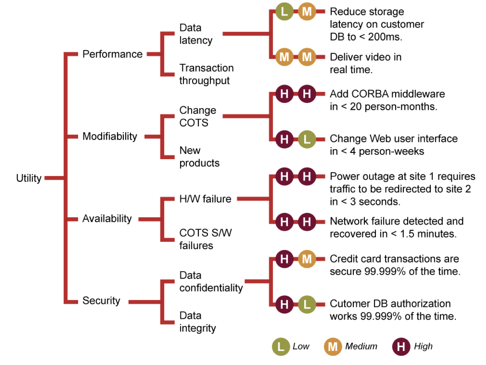

# Stakeholders
We've mentioned a few times that what matters is who the system is *for*, not what the system *does*. Of course, there are multiple different sets of interested parties. These are the stakeholders.

Back to our Blue Bridge example. Who are the stakeholders in this project?

For the project, I've asked you to fill in a table from the Rozanski and Woods approach. It looks something like this:

| Role | Concerns | Instances |
|-----|----------|-----------|
| Acquirers |	Oversee the procurement of the system or product | |
| Assessors |	Oversee the system’s conformance to standards and legal regulation | |
| Communicators |	Explain the system to other stakeholders via its documentation and training materials | |
| Developers |	Construct and deploy the system from specifications (or lead the teams that do this) | |
| Maintainers |	Manage the evolution of the system once it is operational | |
| Production  Engineers |	Design, deploy, and manage the hardware and software environments in which the system will be built, tested,  and run | |
| Suppliers |	Build and/or supply the hardware, software, or infrastructure on which the system will run | |
| Support  Staff |	Provide support to users for the product or system when it is running | |
| System Administrators |	Run the system once it has been deployed | |
| Testers |	Test the system to ensure that it is suitable for use | |
| Users |	Define the system’s functionality and ultimately make use of it | |

Let's fill that in for the Blue Bridge example.

Why do we care about who the stakeholders are? These are the people with varying levels of need and interest in a system. At the least, we need to think about who the *documentation* stakeholders are. If we are doing a system design, we need to think about who should be consulted. And at the end of the project, we evaluate success with respect to stakeholders.

> A good architecture is one that successfully meets the objectives, goals, and needs of its stakeholders. (Rosanski and Woods)

Some stakeholders are more important than others. In one project I consulted for, stakeholder users wanted the search function to find the result in less time (it was taking *minutes*). They were used to Google speed (milliseconds), and yet, solving these problems turned out to be very complex.

Our documentation needs to do different things for different people. Who the stakeholders are will help us determine that.
 
# Requirements, Architecturally Significant Requirements, and Quality Attributes

## Requirements
Let's classify requirements along the lines of Martin Glinz's paper "On Non-Functional Requirements".

As architects, we often assume the requirements come from somewhere else - product owners, business analysts, requirements engineers, etc. But in truth architects need to have a deep familiarity with the requirements. For one thing, it allows them to decide which direction to take the project. And for another, the "Architecturally Significant Requirements" (ASRs) have a profound impact on the system. So architects have a vested interest in ensuring they are properly specified.

## ASRs 

Let's think about how we do design and/or architecture. Design is the process of mapping a solution onto the given problem. One of the things we need to know when trying to understand a code base is what, exactly, are the set of requirements it is responding to. This is made more difficult in open source software, where the requirements process is much less clear. For instance, the requirements might be self-derived or taken from vague milestone planning processes.

For your project, M2 asks you to provide

- The list of ASRs
- A fully worked out utility tree, with at least 7 prioritized quality attribute scenarios, 3 in template form.

In order to find the ASRs, you should think about what an architect would do in a "rational design process". Which they may not have followed, of course.

- Requirements define expected behavior, ideally in concrete (yes/no) terms.
- Architecture provides an analysis model to predict behavior of the eventual system
- Properties (e.g. via testing) show actual behavior, which we analyse to determine satisfaction of the requirements.

We worked out an example with Modifiability.

Architects/designers are (at least implicitly) thinking about their system in this way. In order to understand what the system's structures are, we need to have some way to recapture this.

The Architecturally Significant requirements are the ones with wide impact on the system. 

## QAS
The first step is to find the ASRs. For our purposes we will make the simplifying assumption that they are most often related to quality attributes (Modifiability, Performance, Usability, etc). However, they are often very underspecified. Why?

We tend to focus on the features and functions clients want, and leave quality to the end.

In order to make our quality requirements more tangible, we will work on scenarios that *test* our system qualities.

## Utility trees
Quality attribute utility trees provide a mechanism for translating the business drivers of a system into concrete quality attribute scenarios.

A *utility tree* shows the prioritization of quality attribute requirements, realized as scenarios.  The utility tree serves to make concrete the quality attribute requirements, forcing architect and customer representatives to define relevant quality attributes precisely.

Those scenarios rated high in importance and high in difficulty provide the most critical context against which the architecture can be analyzed.  These scenarios are candidates for the ASRs.

Utility trees are specific to the client project you are working on. 

# Deriving QAS from Utility Trees
One way to figure out a Utility Tree is to conduct a workshop with stakeholders to elicit the important business drivers/goals, figure out the proposed architecture, and identify the key architectural *drivers*. An architecture driver is a key decision that will influence what the system can and cannot do. 

Ideally, we would get a long presentation from a knowledgeable business person for the first, the architect would show us the plan, and then all of the stakeholders would help prioritize key scenarios. However, we don't have any of that. Our business drivers will. have to come from your analysis of the stakeholders and the system. And the architecture decisions are things you will have to work out.

## Exercise

We are going to walk through a quick utility tree exercise. 

I went over the business and architecture approaches for the [Twitter observability platform](https://blog.twitter.com/engineering/en_us/a/2016/observability-at-twitter-technical-overview-part-i.html)

## Business Presentation
As I briefly state the business case, write down things you feel are important about this system wrt architecture.

## Architecture Presentation
As I sketch the architecture approach, write down the key business goals and quality attributes you hear being mentioned (perhaps implicitly; remember the project will not necessarily use the same jargon).

## Architecture Drivers
In your group, compare notes on the last two presentations and identify the key architecture drivers you think this new system has.

## Scenario Generation
For each of the drivers, propose a scenario that will show how well the architecture drivers will support the scenario. Scenarios are intended to map to (satisfy) business drivers.

Scenarios have these parts (I have omitted portions of the SEI template not important for our purposes).

| Aspect | Details |
|--------|---------|
|Scenario Name | |
|Business Goals | |
| Quality Attributes | | 
| Stimulus | |
| Stimulus Source | | 
| Response | |
| Response Measure ||

- *business goals*: the impacted business goals
- *quality attributes*: the key QA involved in this scenario
- *source* – an entity that generates a stimulus
- *stimulus* – a condition that affects the system
- *response* – the activity that results because of the stimulus
- *response measure* – the measure by which the system’s response will be evaluated

We then worked out a scenario in class to show the template. I am asking for three templates in M2. The textbook has good examples on the inside front cover. I would tell you that a QAS is like an acceptance test or system test. It allows you to see to what extent the proposed design will meet the scenario.

## Utility Tree
Once you have a few scenarios, you can begin to group them by quality attribute. Furthermore, we need to prioritize our scenarios because we can't fix them all. We want to give the stakeholders the 5 or 6 scenarios that we feel (that is, the stakeholders and the review team) are most important to the business (H), and most difficult to fix or implement (H).

Ideally, we would create these artifacts prior to designing an architecture or writing code. It helps us to figure out what we need to focus on. Since we are trying to understand an existing system, we will use the Utility tree as a way of identifying the interesting parts of the system to focus on for the other deliverables. Here my logic is that if we want to know what is important to communicate, we should start by asking what QAS are important for the stakeholders. 

# References
1. https://www.viewpoints-and-perspectives.info/home/stakeholders/ 
