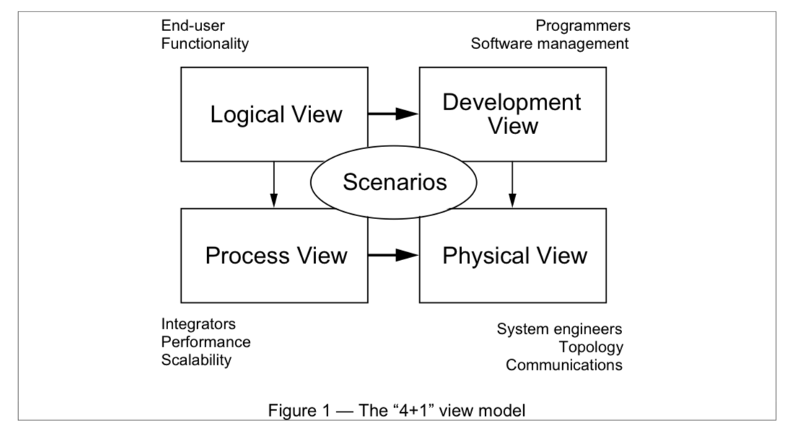

# Structures
If you recall, we talked about the types of structures that exist in the Blue Bridge project. This was because our definition of software architecture was the "set of structures that are needed to reason about the system". A *structure* is a set of components, relationships, and properties of both. In other words, we could think about representing a structure with a typed graph. And indeed, most architecture documents show some flavour of a typed graph ('boxes and lines').

What is important, of course, is what those components, relationships, and properties look like. In this course we will put fairly strict constraints on what can be in a given structure. What is allowed and not allowed defines what type of reasoning we can conduct. 

We can also think about a structure as view on a particular system. Depending on our perspective, the views can be defined to show different information (just like a database). For software, what we want to show will be informed by what we care about. Typically, this is to answer questions like:

- what is going on when the system is running?
- how do we organize the code to work on it?
- what pieces need building first?
- how does it handle my requirements?
- what parts are from other vendors?
- how do I deploy this?
- what types of hardware demands does the system have?
- how does it manage security?
- how fast is it running?

# Other types of "views"
## 4+1 Views (Philippe Kruchten, UBC/Rational)
In the [Rational 4+1 views](https://www.cs.ubc.ca/~gregor/teaching/papers/4+1view-architecture.pdf) model, we see a constrained set of views that tell us what exactly we ought to care about as developers.

1. A **logical** view showing the object oriented structure of the design
2. A **process** view, showing us concurrency and runtime behavior
3. A **physical** view, showing how the software gets mapped onto hardware.
4. A **development** view, showing how the code is structured for developers.

Tying these together is a **scenario** view that captures key system use cases.

## Rozanski and Woods
The other course in Delft follows the Rozanski and Woods book. They introduce the notion of *viewpoints*, which are similar to views. 

1. Functional, what functionality the system offers
2. Information, how the system manages data
3. Concurrency, how a system handles threads and processes
4. Development, as above.
5. Deployment, map the software onto hardware.
6. Operational, how the system is managed in production.

These show very similar structures as the 4+1 model, with a difference being that RW are focused on ensuring that key stakeholder question are answered by the views chosen.

Both approaches are concerned with capturing information about the system that helps us answer our questions of interest (in our jargon, allowing us to show how the architecture satisfies key quality attribute scenarios).

Views/viewpoints are abstractions; each system must choose an instance of a view to show the elements specific to that system. The particular arrangement of the elements may reflect the application of an architectural style; a common solution to a given problem (like a design pattern)

# Types of Structures
In the textbook world, there are three key sets of structures we need to create views into, and reason about. 

1. Module Views
2. Component and Connector Views (C&C)
3. Allocation Views

We'll focus on the first two for now; I'll talk about allocation views more when we discuss capturing operations. 

## Module Views (p. 332)

*Elements:* modules, implemetnation units of software with a coherenet set of responsibilities.
*Relations*: typically *part of*, *depends on*, *is-a*
*Usage*: change impact analysis, incremental development, work assignment, information structures

### Instances of Module Views - Styles
1. Layers
2. Decomposition
3. Generalization
4. Data Models
5. and others 

Each style imposes constraints on the view topology (e.g. no circular relationships) and relevant properties (always *name*, but perhaps *strength of relationship*, *responsibilities*, etc.)

