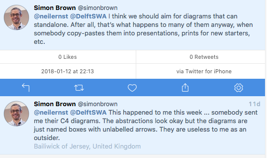
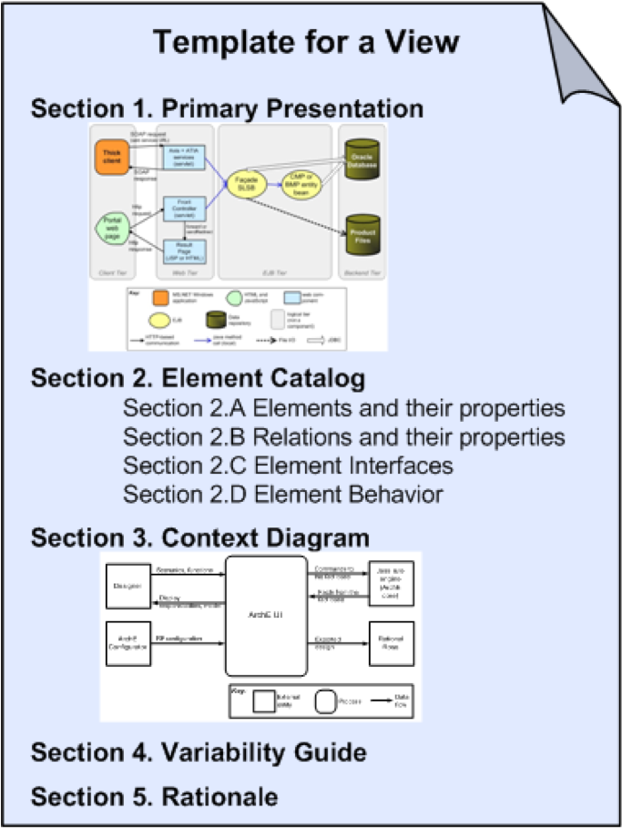
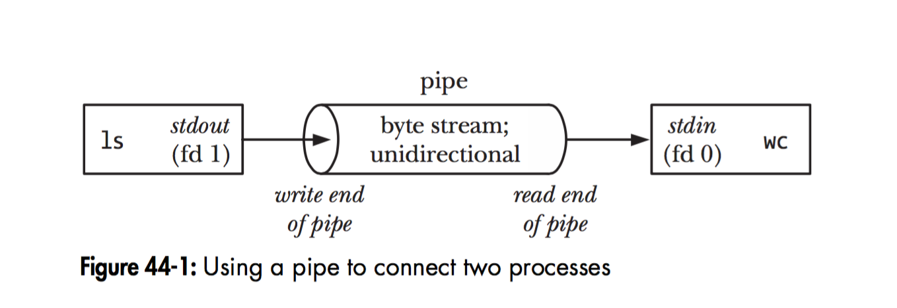

# Representing Views

The style we chose (layers, uses, etc) are often thought of as primary presentations. A primary presentation is the graphical representation of the view, but does not in itself constitute documentation. What are some of the problems with doing it that way?

They include not disambiguating various elements of the diagram; missing rationale; missing data points that help answer e.g. latency questions, capturing strange cases like shutdown behavior, and other items that would clutter or confuse the diagram. 

There is a strong argument to be made that this information *should* be on the diagram itself. In many situations, all you get is a 10 slide Powerpoint deck with a bunch of diagrams. It sure would help to have more details. 

We mentioned earlier that good documentation follows some standard organization. Think about your project. These are chapters in a bigger book. It sure would help readers if every chapter followed the same structure. 

While I present one approach for capturing information on a view, there are other approaches equally viable (and the DelftSWA course show one other approach). 

This is from Fig 18.3 in the text (3rd ed). You can find this and a [fully worked example here](https://wiki.sei.cmu.edu/sad/index.php/Template:ViewTemplate). [An example of a 'uses view'](https://wiki.sei.cmu.edu/sad/index.php/OPC_Module_Uses_View). **Your project should be following this organizational approach for M3 and M4**.

The first section is the primary presentation. 

Next, we describe the elements in the primary presentation. We need to list what they are and how they are related. The next two sections are critical for the "blueprint" view of the documentation. We should capture how these elements connect to one another; at its most basic this is an API specification (method name, parameters, return values, semantics). We also need to capture the ways these elements behave at runtime. This might be a statechart showing all possible interactions, or a trace of behavior (e.g. a sequence diagram). We will discuss both of these later in the course. 

We will show a context diagram, putting this view in the context of the entire system, and external systems it interacts with. The *variability guide* will explain to readers where things can change in the system. Finally, rationale will explain why this view is the way it is. We describe decisions made (and why), alternatives considered, obstacles, etc.

# Component and Connector Views (p. 332)
*Elements*: components: principal units of runtime interaction and data stores and connectors: interaction mechanisms
*Relations*: attachment of components’ ports to connectors’ roles (interfaces with protocols)
*Properties*: name, relevant QA

## Why We Care - questions C&C views can answer
* Specifying the behaviour that elements must exhibit
* Show how the system "works"
* Reasoning about runtime system quality attributes such as performance, security, and reliability
* What are the major executing components?
* Which parts of the system are replicated?
* Data Flows
* Which parts of the system can run in parallel?

# Instances of C&C Views - Styles
1. Pipe and Filter
2. Client-Server
3. Shared Data
3. Pub-Sub
4. Service Oriented

# Pipe and Filter
Show dataflow. Filters transform data and pass it along Pipes. Analyze system throughput, function composition.

*Elements*: Filters, data transducers as components. Pipes as one way data conduits.
*Relations*: ports connecting pipes and filters.
*Constraints*: restrict loops and branches.

# Client-Server
Shows modifiability and reuse possible in a 2 tier architecture. Analyze availability, connections expected, requests, interface needs.

*Elements*: Client invokes services from Server. Request/reply connector joins them.
*Relations*: attach client to server
*Constraints*: number of tiers; how connections are made;

# Exercise
In your groups, create a client-server diagram for a multiplayer game like [DOTA](http://www.dota2.com/play/).

# Shared Data
Read and write to a shared data store. Analyze data needs, identify who connects.

*Elements*: data stores and accessors.
*Relations*: attachments.
*Constraints*: how the data is attached via connectors.

# Pub-Sub
Decouple listeners from publishers. A very common pattern (e.g. Observer), it essentially wraps up asynchronous/callback architectures. Helps isolate consumers and producers, analyze decoupling and independence in your architecture.

*Elements*: publisher and subscribers. Possibly the bus for distributing messages
*Relations*: attachments.
*Constraints*: who can listen, message semantics.

# Services
We'll cover services in a later lecture. 
