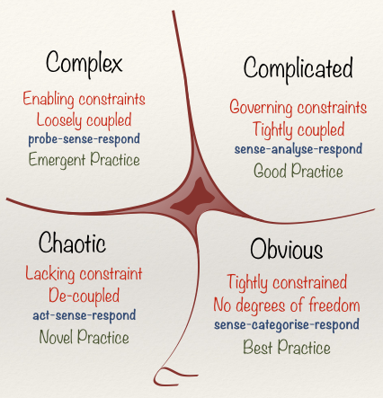
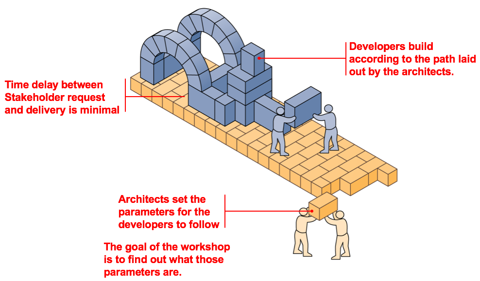
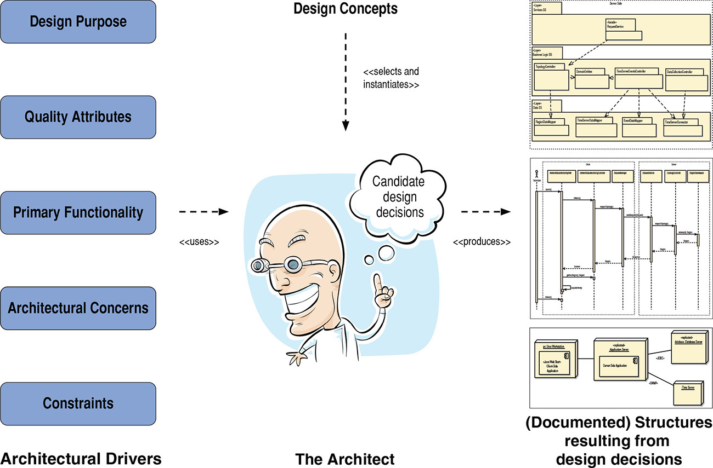
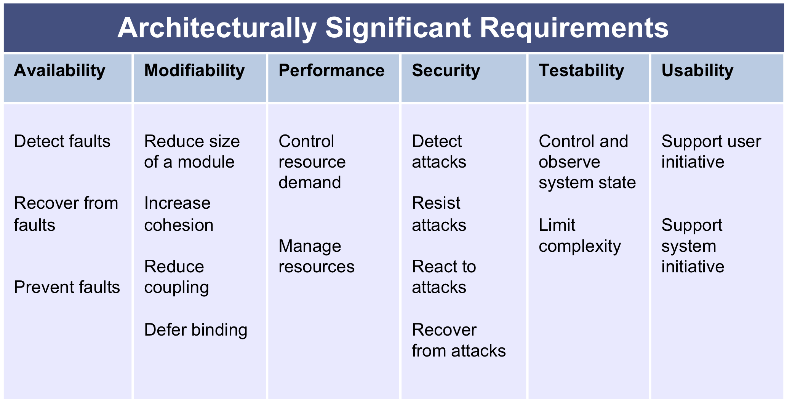

The purpose of this lesson is to acquire some idea of what software design is about. We will learn one (of many) approaches to designing software, ADD 3.0.

# What is Design?
We began with an exercise to brainstorm what we think "software design" is. We discussed design in programming assignments, and what design looked like for systems like Linux, Apache webserver, and the Space Shuttle.

I showed the NASA complexity video. It comes from the excellent [From the Earth to the Moon](https://en.wikipedia.org/wiki/From_the_Earth_to_the_Moon_(miniseries)) series, episode 1.

Cynefin[^1] is a useful, rich model for understanding where your project fits as far as complexity. 

We need different design practices depending on where on that model our project fits (or we think it fits). 

 

There are a few different 'styles' of software design you will encounter. 

1. *Ad-hoc design*. This is abdication of design as an important activity. We should recall that design exists at many levels; but how many projects have a substantial vision beyond 'solve this problem', often a problem the original implementer had (play music on Linux, make a cool video game, sell an operating system to IBM). Obviously, very low upfront cost.
2. *Incremental design*. This is where some semblance of design happens before a given iteration, but the design is often rough and filled in only during the sprint/iteration. This is the architecture runway.
3. *Upfront design*. Here, we try to account for extremely detailed design questions, to the point that all that remains is to flesh out the code itself. This is possible, but expensive. It requires extensive simulation, works best in systems that stand-alone (ie. don't rely on external inputs), and systems where the unknowns are 'known'.

Projects exhibit aspects of all of these. 

Question: what makes a good design?

Answer: the main Architecture drivers all address the important quality attribute scenarios! That is the point of the QAS module. Otherwise, it is hard for us to objectively state whether this approach is better or worse than another approach.

Challenge: sometimes the important scenarios are only visible in hindsight, or after a particular growth target is reached. 

The [Google File System](https://en.wikipedia.org/wiki/Google_File_System) was a design that served Google very well (e.g. availability, robustness, performance) but was eventually replaced with a new design, Colossus. 

> Google's operations have scaled orders of magnitude beyond anything the system had been designed to handle. [(The Register)](http://www.theregister.co.uk/2009/08/12/google_file_system_part_deux/)

| GFS | Colossus |
|-------|--------|
| commodity hardware -> many h/w failures | replicate master and avoid single PoF |
| data throughput over latency | latency more important than before |
| append over write | support BigTable operations |

Point: good designers iterate and improve. One of the nice things about software is we can replace pieces of it as we go.

We iterate, but we also do tradeoffs. No one system can satisfy every quality attribute scenario. Some common tradeoffs:

* immediate functionality over long-term quality (sort of a meta tradeoff, this can lead to technical debt)
* performance over security
* availability over performance
* performance over maintainability

A similar situation exists when we design distributed systems, using the [CAP theorem](https://en.wikipedia.org/wiki/CAP_theorem): Consistency, Availability, Partition-tolerance, pick 2.

# Attribute-Driven Design (ADD)

Good design practice involves three aspects.

1. Good knowledge of the problem domain. It is hard to design a good banking system with no understanding of the business goals.
2. Experience. Design skill is usually acquired through practice (and failure!). 
3. Design toolkit. Good design knows the ways other people have approached the problem, knows the relevant academic literature (e.g. the Papers We Love community), and pattern and style repositories. 

The book introduces an approach, Attribute-Driven Design, that tries to provide a framework for design process, that will lead to good outcomes. We'll walk through that today. The framework will work from our quality attributes and satisfy the QAS as a essential part of designing/redesigning a system.

# Exercise
 You have been tasked with designing an architecture that supports functionality of this kind: 
 
> A unified management station for the building automation domain that automatically monitors and/or controls the internal functions of buildings, such as heating, ventilation, air conditioning, lighting, access, and safety.

What next? Get together in teams and figure out your initial set of actions as the lead architecture team.

(after R. Sangwan, et al. 2007. “Integrating a Software Architecture-Centric Method into Object-Oriented Analysis and Design.”  Journal of Systems and Software.)

# Design as Test

One method to do design is to treat it as a series of experiments. We will propose a potential design, test it with our QAS, and then propose a new design until it satisfies the tests/QAS.

## Testing Modifiability
We want to minimize the cost of changing the software. Modification cost is the cost of modifying a component's responsibilities and any costs to modify its downstream dependencies.

How can we test whether our system is modifiable? 

We can look at **impact analysis** for our module structures. How much time will it take to change the direct component A, and how many components downstream of A will we need to fix? Do other systems depend on A? Can we test our change effectively, or will we not know if the change was successful? (do we have a sense for what our dependencies even are?)

# Steps of ADD

1. Choose an element of the system to design. Decompose beginning with the overall system.
2. Identify the architecturally significant requirements for the chosen element.
3. Generate a design solution for the chosen element.
4. Verify and refine requirements and generate input for the next iteration.
5. Repeat steps 1-4 until all the architecturally significant requirements have been satisfied.

## Design Solution
This is the heart of the challenge (text, p. 321). Given the test - the ASR/QAS you are focused on - you, the designer, choose a way to satisfy that. This is where past experience and knowledge of relevant patterns is important. 

At the end of this step, the architectural design consists of major types of elements that will appear in the architecture, the types of relationships between them, and the instantiation of the software element types. In other words, one outcome will look something like your module/C&C view of the system in the documentation. This is not accidental; design and documentation are mirrors of one another.

1. Identify design concerns.
2. Create a list of alternative patterns.
3. Select patterns for satisfying the candidate architectural drivers.
4. Instantiate every type of element.
5. Assign responsibilities.
6. Analyze and document the design.

## Design Concerns

 

We then select designs that address the concerns. One way to do this is with design patterns and architecture tactics. Design patterns were covered in SENG330/350. Architecture tactics are similar, but focus on the solution to a particular quality attribute. For example, to handle *Performance*, we need to *Manage Resources*. Some tactics to do this include *using concurrency*, using *multiple copies of the data*, and *bounding queue sizes*

You can find more tactics in the book. Most of the book covers architecture tactics. 

### Frameworks, libraries and platforms
Another way to assign responsibility to satisfy a design concern is with an externally developed component. For example, I may delegate responsibility for my authentication mechanism to Google's OAuth implementation. This means I no longer have to take charge of managing the complexity of password management, hashing, and so on. 

# Exercise
We are building a web app that helps us [identify tubular meat products](https://itunes.apple.com/us/app/not-hotdog/id1212457521?mt=8). But we want to allow our EU friends to enjoy this app as well. Problem is, we will need to support different languages (otherwise we will lose users). We will not copy and paste code. How can we redesign the app to support i18n?

In your groups, identify an initial design solution that will remedy this situation. 

Our architecture driver is "support i18n".

<!--Driver #2: International Language Support
There are three design concerns related to modifiability:
 Increase cohesion: changing the user interface to deal with a new    language and culture
 Reduce coupling: minimizing the number of modules affected    as a result of changing the user interface
  Defer binding: delaying the time when the language is chosen
-->

1. What QA is most relevant here?
2. What *design concerns* do we need to think about? Identify 2 [modifiability tactics](https://resources.sei.cmu.edu/asset_files/TechnicalReport/2007_005_001_14858.pdf) that are relevant. (use the back of the book). 
3. Identify 1 externally-developed solution that might help with the problem.
4. For each tactic and the OTS solution, identify the tradeoffs each makes in solving the problem.

# References
1. Designing Software Architectures, Cervantes and Kazman, 2017.
2. NASA in SpaceFlight, https://history.nasa.gov/computers/p114.htm
3. Kurtz, Cynthia F.; Snowden, David J. (2003). "The new dynamics of strategy: Sense-making in a complex and complicated world" IBM Systems Journal. 42 (3): 462–483. doi:10.1147/sj.423.0462. 