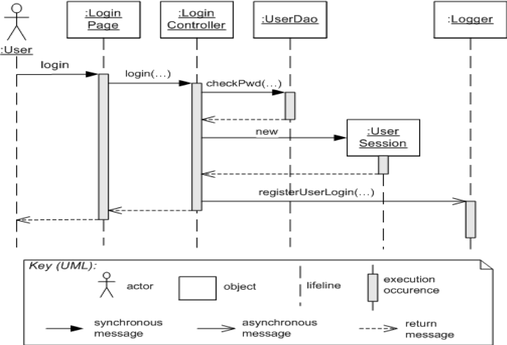
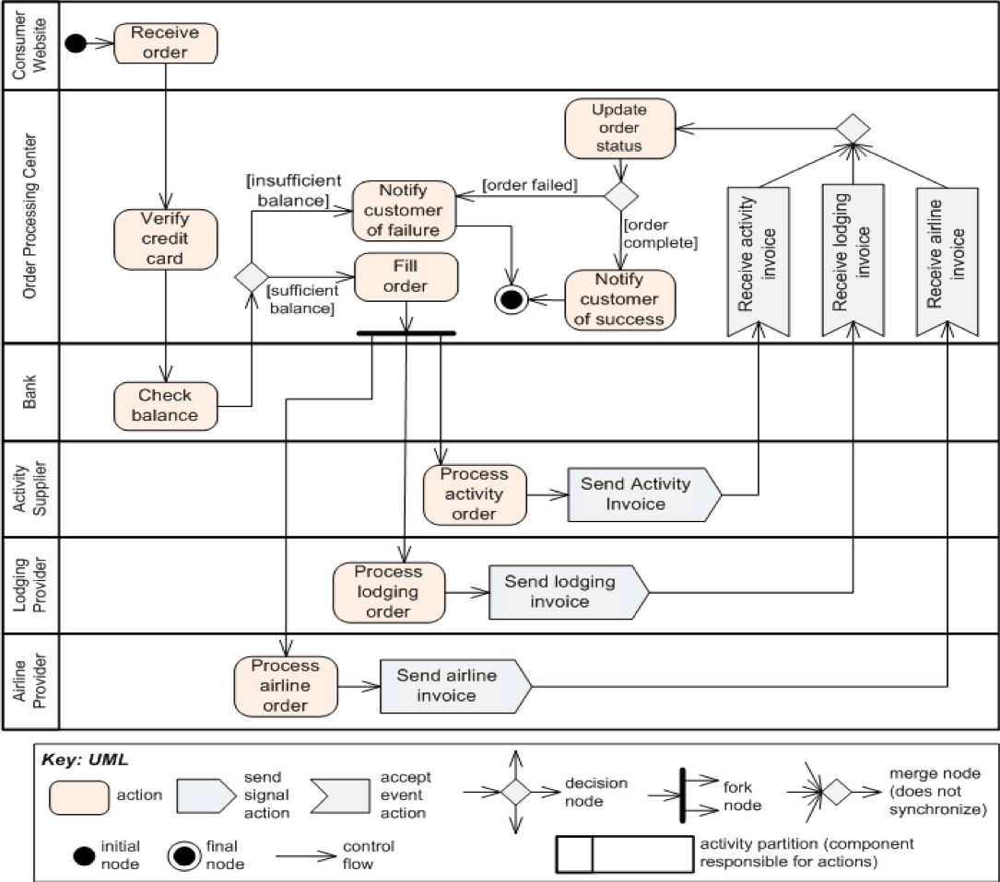
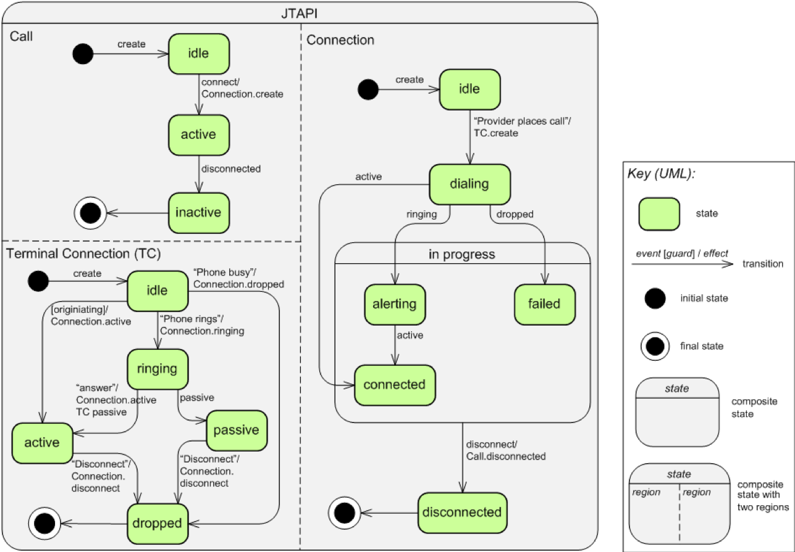

# What Is Behavior

If you recall, we said there are three important types of views we can take on software systems.

They were modules, component and connector, and allocation. Reflecting static development structures, runtime structures, and non-software structures respectively. All of these views show the *existence* of objects. E.g., the fact there is a relationship between modules A and B; the fact there is a runtime component attached to a publisher, and where hardware nodes live. They capture potential.

But they don't really show a pattern of interaction, the sequence of actions and behaviors. In other words, once I read the primary presentation, I know what could be; but I don't how it gets done. In the 4+1 views approach, we understand a system by using scenarios to walk through our system views. In the textbook, we will do something similar, but we will associate each view (for example, a pipe and filter view) with a set of behavior descriptions; in other words, we will add some descriptions that explain how all the puzzle pieces work together. 

Some questions behavioral docs help us answer:

- In what order do components interact in this transaction? 
- What is the response time of this transaction?
- What is the system’s throughput under these conditions? 
- What states does a system element take on during a transaction?
- Do these elements run in parallel during this transaction?
- Can the system ever deadlock?
- What happens if this input is received?
- How does system startup or shutdown proceed?

It helps us to reason about interaction among elements; trace to use cases and scenarios; explain how the system works to newcomers; reason about certain quality attributes like performance.

# The View Template
Where should we stick anything we say about behavior? 

1. in the behavior section of the primary presentation
2. in the system rationale
3. in the interface usage guide (e.g., [an API example](https://developer.github.com/v3/))

# 2 Types of Behavior Diagrams
There are two types of behavior Diagrams we will see. One is **trace-based**, and takes a single trip through the system. It covers a single set of actions. Think of this as a narrative: I went to the bank, I put my card in the ATM, I withdrew money.

The other approach is **state-based**. This type of behavior documentation captures the entirety of the *possible* behaviors of the system. Think of this as mapping out the entirety of possible interactions with an ATM: maintenance, withdraw, deposit, check balance, etc.

Each type helps us answer different questions.

# Trace-based notations
Describe the system (or subsystems) response to a specific stimulus. Close correspondence to use cases and scenarios.

Some common ways of annotating these:

1. Use Case Diagrams
2. Sequence Diagrams

3. Activity diagrams

4. Process models

# State-based notations
Show alternatives and all potential scenarios. Comprehensive.

Some common state-based notations:

1. [State machine diagrams](https://en.wikipedia.org/wiki/UML_state_machine)

2. Formal specifications like [Z](https://en.wikipedia.org/wiki/Z_notation)
3. [Communicating Sequential Process](https://en.wikipedia.org/wiki/Communicating_sequential_processes)
4. [TLA+](https://github.com/tlaplus) ([example](https://medium.com/espark-engineering-blog/formal-methods-in-practice-8f20d72bce4f))

# Group Exercise

Consider a car radio which can seek new stations, power on and off, manually tune and adjust volume, has presets, and a digital display. 

1. which notation from the ones above would be good to describe the behavior of the radio?
2. Using one such language from above, sketch the radio's behavior.
3. If you wanted to analyze whether weird behavior might happen, like the screen going blank when a preset was held down, which approach would you use?

