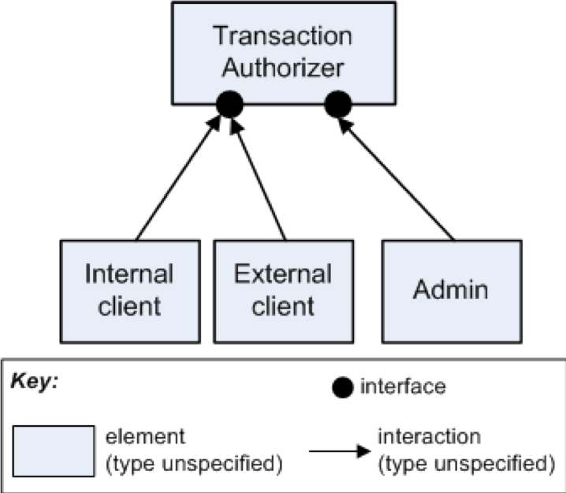
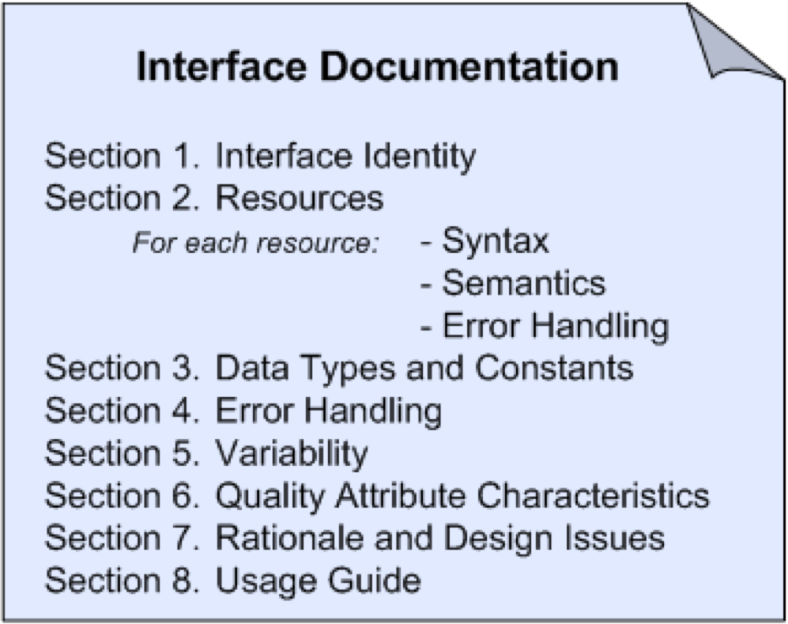

# Why Document Interfaces?
So far we have thought about our challenge as abstracting the implementation details from the code, in order to summarize and analyze the core views on the software structures. We did this abstraction in order to answer questions from stakeholders. In particular, we focused on *quality attribute scenarios* as test cases for our system, and *business goals* as the ultimate source of prioritization for the key abstractions we choose.

If you recall, most of our views consist of nodes (boxes) and edges (lines), specialized for various different kinds of view. One thing we have left out to this point is how exactly these lines connect the boxes (and our boxes to outside boxes). At some point, in other words, a developer will have to wire this stuff together, and at that point we better have a pretty good understanding of:

What do you think interfaces help us understand? 

Is this a good interface document (box and line)
$$
- how much data will be sent
- what happens if something goes wrong
- what data types we will use
- what names mean (is my Customer the same as your Customer?)
- the state of the world *before* and *after* our transaction.

My favorite [interface video.](https://www.youtube.com/watch?v=Z3csfLkMJT4)

My favorite [interface story](img/MCO-root-cause.png).

# How to capture interfaces
An interface is a boundary across which two elements meet and interact or communicate with each other. Like everything in this course, we only document interfaces to the extent we care to communicate it to stakeholders. 

All elements (in our views) have interfaces. All software elements interact with their environment.  The architect decides which aspects to document.

An element’s interface is separate from its implementation. We often have multiple elements that provide the same interface. 

An element can have multiple interfaces. 

An interface can be documented for a single element, a collection of elements (such as a layer), or an entire system.

Elements not only provide interfaces but also require interfaces. An element makes use of other elements’ resources or assumes that its environment behaves in a certain way. 

Multiple actors may interact through an interface at the same time. Some interfaces don’t allow this because of synchronization and multi-threading issues. Make that clear in the interface documentation. 

# SEI Interface template
1. **Interface identity**---some obvious name. This is not easy; it is as hard as naming a method or an object. It should be memorable and perspicuous. 
2. **Resources provided**:

	a. Syntax: this is like a method signature. We can also use standards designed specifically for this, such as Interface Defn Languages (IDL) or Web Service Defn Languages (WSDL). Where would JSON or YAML or Protobuffers fit?
	b. Semantics: effects of using the resource. Usage restrictions; pre/post conditions; values assigned; whether the resource changes or not (idempotence); new properties observed after the interface is used. We can use natural language, behavior diagrams, or formal languages (e.g. timing diagrams). As usual, there are tradeoffs of precision and cost. How important is it that you know what units you are getting trajectory fixes in?
	c. Error handling: what happens when something goes wrong. E.g., does the resource revert back (rollback) to its initial state.
3. **Data types**: what do we mean when we say "String"? What is a "Customer"?
4. **Error handling** (overall)
5. **Variability**: how the interface may change, e.g., if peak load restrictions are exceeded.
6. **Quality attributes**: e.g., performance impacts possible.
7. **Rationale**: Why the interface was designed this way.
8. **Usage Guide**: Most important of all; how to actually use the interface with usage examples. 

# APIs vs Interfaces
What is the difference between an API (Application Programming Interface) and Interfaces as covered so far?

Probably the simplest distinction is that an API is owned by someone else, and an Interface is owned by you. Most of the views we are capturing will show *our* software, for some definition of 'our'. In some cases, the different components will span teams in a giant organization. Some teams responsible for a module may be subcontractors, or consortia members, or in different timezones. 

One key distinction to keep in mind is whether or not you can ask the interface owner for changes, or possibly the ['private' API](http://www.stratigery.com/nt.sekrits.html#hidden_api). Of course, the consequences of this are the same as any violation of information hiding: when the team changes the interface, you must also change. This can be extremely painful when interfaces grow in number, or age. 

Amazon [famously forced all](https://apievangelist.com/2012/01/12/the-secret-to-amazons-success-internal-apis/) its internal teams to treat one another like 3rd party/arms-length collaborators. 

	- All teams will henceforth expose their data and functionality through service interfaces.
	- Teams must communicate with each other through these interfaces.
	- There will be no other form of inter-process communication allowed: no direct linking, no direct reads of another team’s data store, no shared-memory model, no back-doors whatsoever. The only communication allowed is via service interface calls over the network.
	- It doesn’t matter what technology they use.
	- All service interfaces, without exception, must be designed from the ground up to be externalizable. That is to say, the team must plan and design to be able to expose the interface to developers in the outside world. No exceptions.

Documenting an API then is different inasmuch as the audience is different. You can not make assumptions about your audience and basic terminology. Good examples of API documentation can be found at Twitter or at [Github](https://developer.github.com/v3/). If you look carefully, you will see the same structure as we discussed earlier. 

API docs have taken much more attention lately, at least in the HackerNews world. I would argue however, that the MCO example shows us that our "internal" interfaces are at least as important. In both cases, though, it seems clear that our course focus on clarity and relevance to the business remain paramount.

# Capturing Interfaces in Docs
Our primary presentation should show what interfaces we are using explicitly. Then, in the Interface portion of the Element guide, we elaborate on what that interface is all about. In systems like ["Read The Docs"](http://bootstrap-datepicker.readthedocs.io/en/v1.7.1/methods.html), interface documentation takes on a much more visible role, since external clients often just need to know this (and less about the system architecture). 

## Informal

## Explicitly
We can 'reify' our interface as a separate class altogether. In Java, for example, this is accomplished with the interface feature. 

We can use lollipops and sockets as well (again, in the primary presentation).

# Group Exercise

Use the template following to capture the interface documentation for the following scenarios. The scanerios share the common theme that the current docs are terrible; your job is to improve it. M4 will use exactly this template. **Make whatever assumptions you need** to make the problem simpler. The idea is to document the interface that this module provides, rather than spending time improving or ironing out details of the design. 

Group 1/2/3: Scenario 1
Group 4/5/6: Scenario 2
Group 7/8: Scenario 3

## Scenario 1
Your team needs to specify the interface for a module that does credit card transaction processing:

`authorize(in cc_number, in amount, in cvc_number, out status, out authNumber`

## Scenario 2
Your team is maintaining the star tracker for a military satellite. You send current position to the rest of the satellite systems, enabling communications, course correction, etc. 

`SEND_CUR_POS(in x, in y, in z, in time, out status)`

## Scenario 3
Your team takes potentially inflammatory tweets and validates they are safe to send to the rest of the world.

`validate_tweet(in text, in user, in time, out status, out valid)`

